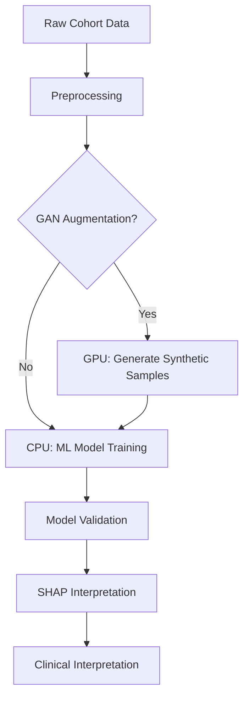

# Mental Health-Enhanced CVD Prediction Using GANs and Machine Learning

**Psychological Factors for Improved Atherosclerotic Cardiovascular Disease (CVD) Prediction**  
*A Machine Learning-based Study Using Lifelines and UK Biobank Data*

## 🔄 Computational Workflow

## 📌 Key Findings 
- **Prediction Improvement**: Mental health data increased AUC from 0.88→0.94 (Lifelines) and 0.76→0.83 (UK Biobank)
- **Key Psychological Predictors**: Childhood trauma and somatic depressive symptoms (fatigue, sleep disturbances)
- **Model Efficiency**: Symptom-level vs sum score models showed comparable performance

## 🛠️ Project Structure

### 1. GAN Components
**Objective**: Generate synthetic mental health-CVD data for augmentation

| File | Description |
|------|-------------|
| `generator.ipynb` | GAN architecture for synthetic data generation |
| `real_synthetic_comparison.ipynb` | Quality assessment of generated vs real data |

### 2. Machine Learning Pipeline
**Objective**: CVD risk prediction with mental health integration

| File | Analysis Stage |
|------|---------------|
| `ML_merged.ipynb` | Main prediction model (XGBoost) |
| `outliers.ipynb` | Anomaly detection in feature space |

### 3. Preprocessing Modules
**Objective**: Cohort data harmonization

| File | Functionality |
|------|--------------|
| `data_preparation.ipynb` | Merging/cleaning multi-source data |
| `convertions.ipynb` | Feature engineering: • Smoking status conversion • Childhood trauma scoring • Symptom sum scores |
| `stats.ipynb` | Cohort descriptive statistics & hypothesis testing |

## 🎯 Research Objectives
1. Quantify mental health's added predictive value beyond traditional CVD risk factors
2. Identify most predictive psychological features through SHAP analysis
3. Develop demographic-adapted models (Lifelines vs UK Biobank)

## 🖥️ High-Performance Computing Implementation

### Infrastructure
| **Resource**               | **Specification**                          | **Use Case**                     |
|----------------------------|-------------------------------------------|----------------------------------|
| **Lifelines HPC Cluster**  | Slurm workload manager                    | Primary analysis environment    |
| - Compute Nodes            | 64-core AMD EPYC, 512GB RAM               | Data preprocessing & ML training|
| - GPU Nodes                | 4× NVIDIA V100 (32GB VRAM)                | GAN training                   |
| - Storage                  | 2PB Lustre parallel filesystem            | Cohort data handling           |
| **UK Biobank**             | IBM Spectrum LSF                          | Validation/ Generalizability   |

